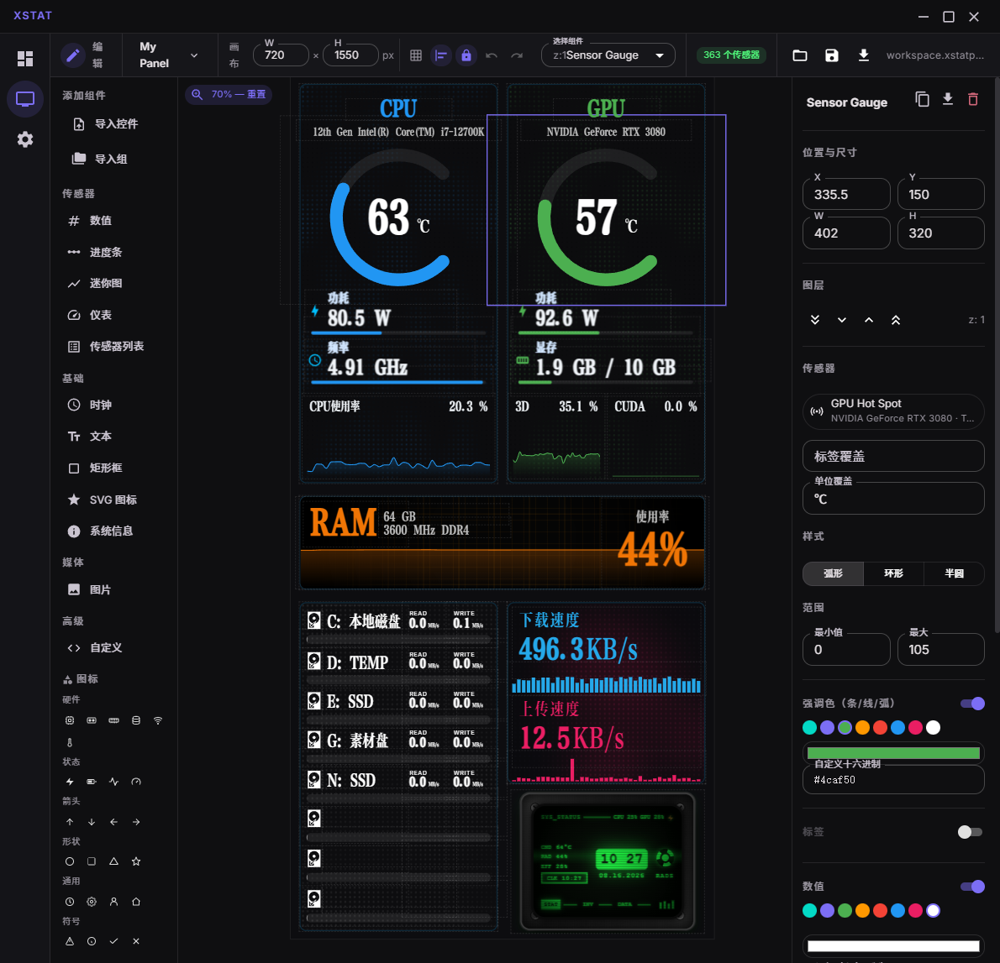

<h1 align="center">XStat</h1>

<p align="center">
  <strong>开源硬件监控 & 传感器面板</strong><br>
  桌面 Electron 应用 + 局域网 Web 面板 + Android 手机端
</p>

<p align="center">
  Fork 自 <a href="https://github.com/Inside4ndroid/XStat-Hardware-Monitoring">Inside4ndroid/XStat-Hardware-Monitoring</a>
  （基线 v0.3.0，提交 <code>f3e66f8</code>），在其基础上进行了深度增强。
</p>

<p align="center">
  
  
  
  
  
</p>

---

> # **注意事项**
>
> 1. 首次使用前必须安装 `resources\pawnio\PawnIO-Setup.exe`，这是服务端读取硬件传感器的依赖组件。
> 2. 若需从局域网其他设备（手机、平板）访问 Web 面板，请在 Windows 防火墙中放行 `9421` 端口（TCP），或临时关闭防火墙。
> 3. 自带演示模板位于 `resources\workspace.xstatpanel`，可从编辑器中打开作为起点。

---

## 截图

<p align="center">
  
</p>

---

## 目录

- [硬件传感器（服务端）](#硬件传感器服务端)
- [面板编辑器（前端）](#面板编辑器前端)
- [新增控件](#新增控件)
- [自定义控件增强](#自定义控件增强)
- [界面与体验](#界面与体验)
- [Android 手机端](#android-手机端)
- [API 接口](#api-接口)
- [技术栈](#技术栈)
- [构建](#构建)
- [许可](#许可)

---

## 硬件传感器（服务端）

- **修复传感器丢失问题** — LibreHardwareMonitorLib 升级至 `0.9.7-pre700`（pre663 的 `Mutexes.Open()` 在部分环境抛 `ArgumentNullException` 导致 `Computer.Open()` 失败），恢复 340+ 路传感器通道（CPU 59 / GPU 42 / 主板 33 / 网络 67 / 内存 58 / 存储 81）
- **精确物理内存** — Total Physical Memory 改为所有内存条 SPD Capacity 求和（16+16+32=64GB），不再因 Windows 保留内存而少算
- **快速磁盘活动** — 新增每块磁盘的 Activity Time / 读取 / 写入速度传感器，通过 Windows 性能计数器直读（不再走慢速串行 SMART），读写速度按 ≥1 GiB/s 自动在 MB/s 与 GB/s 之间切换
- **网络总量** — 新增汇总所有网卡的上传 / 下载总速度传感器
- **按需订阅** — SensorHub 新增 `Subscribe(SensorFilter)` / `SubscribeAll()` / `GetHistory()`，实测单次推送约 50KB → 约 1KB
- **自定义端口** — 支持 `--ServicePort` 启动参数，Electron 设置页修改端口后自动重启服务并热切换所有连接
- **新增 REST API** — 系统信息、自定义控件 HTML（`/api/widget`）、字体、诊断等控制器

## 面板编辑器（前端）

- **控件复制** — 复制 / 粘贴控件
- **撤销 / 重做** — Ctrl+Z / Ctrl+Shift+Z，覆盖所有编辑操作
- **智能对齐参考线** — 拖动**和**缩放控件时吸附到其他控件的边 / 中心，带总开关
- **控件成组** — 分组后整体移动 / 复制 / 导出 / 导入（`.xstatgroup`）；点击组成员即选中整组；成组 / 解组 / 复制组 / 导出组 / 导入组
- **多选编辑** — 框选多控件后批量操作与统一属性编辑
- **多面板** — 多面板创建、切换与激活面板推送
- **画布属性** — 新增画布级属性配置（宽度、高度、背景色、网格等）
- **工作区脏标记** — 任何编辑后「保存」按钮才可用，避免误覆盖

## 新增控件

- **SVG 图标** — 容器内渲染任意 SVG 代码，内置代码编辑器与图标颜色设置
- **系统信息** — 显示 CPU/GPU 型号、内存容量/频率、磁盘、系统版本等，逐项开关
- **Box 动画** — 9 种动态背景效果（网格、雨滴、光斑、霓虹、矩阵等）
- **Sensor Sparkline** — 新增自动缩放开关，关闭后可手动固定 Y 轴最小 / 最大值
- **文本** — 完整的文本样式编辑（颜色 / 字号 / 粗体 / 斜体 / 字体 / 对齐）与文本阴影
- **图片** — 像素化渲染开关（`image-rendering: pixelated`，适合像素风素材放大）

## 自定义控件增强

- **按需订阅自动推断** — 静态扫描控件 HTML 中的 `.category / .type / .name === 'X'` 比较，自动推断所需传感器并订阅；附 [CUSTOM_WIDGET_GUIDE.md](CUSTOM_WIDGET_GUIDE.md) 使用文档
- **文件附件** — 支持 `./data/…` 引用控件自带文件
- **属性面板可配置属性** — 控件声明 `__xstatConfig` 数组后，右侧属性面板自动生成表单（颜色 / 文本 / 数字 / 开关 / 下拉 / 滑块 / 传感器选择器 / 文本样式编辑器），改动值随数据以 `props` 推送到控件
- **传感器选择器绑定** — `type: 'sensor'` 配置直接在属性面板选择传感器并自动订阅
- **字体直引加载** — 控件只需写 `font-family: '字体名'`，XStat 自动提取字体名并转 data URL 注入（字体桥）
- **双环境稳定渲染** — 网页端走服务端 HTTP 端点（`/api/widget`），Electron 桌面编辑器走内存 srcDoc；内置 paint-check 空高度重建保护

## 界面与体验

- **多语言** — 完整简体中文与英文界面（i18n）
- **移动端适配** — 优化移动端显示、锁定页面缩放
- **字体系统** — 面板自定义字体加载（本地字体注册与接口下发；字体下拉动态枚举系统真实安装字体，含中文字体）
- **工作区管理** — 保存 / 打开命名工作区（含多个面板）；首次运行自动加载内置示例工作区
- **导入 / 导出** — 控件（`.xstatwidget`）、组（`.xstatgroup`）可导出为 JSON 并导入；工作区（`.xstatworkspace`）可保存 / 打开
- **设置页** — 自定义服务端口（1024–65535）、LAN Web 面板地址 / 一键复制 / 二维码、开机自启、启动最小化、语言切换
- **Electron 主进程加固** — 服务进程校验（`/health` 返回进程 ID 与可执行路径，不一致时自动重启）；开机自启、托盘启动
- **连接自动重试** — 传感器初始连接失败时每 3s 自动重试，不再永久报错
- **局域网 Web 面板** — 任意设备浏览器打开 `http://<局域网IP>:9421` 即可实时查看面板；支持多面板切换（连点 3 次呼出切换器）；面板选择自动保存到本地（localStorage），刷新或重开后保持上次选择

## Android 手机端

- **启动连接方式** — 首次启动选择「局域网自动搜索」或「手动输入地址」，自动记住
- **设置页重构** — 多地址管理、局域网搜索快捷切换、屏幕常亮、应用内语言切换
- **无按钮手势** — 全屏 WebView，同时按音量 + 和音量 − 打开设置页
- **断线自恢复** — 后台每 1 秒探测 `/health`，连续 3 次失败自动重连
- **加载失败重试** — 面板加载失败每 3s 自动重试，并提供手动重试按钮

---

## API 接口

服务端默认监听 `9421` 端口；桌面端可在设置页修改端口，或以 `--ServicePort=<端口>` 参数启动。

### HTTP REST

| 接口 | 方法 | 用途 |
|---|---|---|
| `/health` | GET | 健康检查：status / version / isAdmin / processId / executablePath |
| `/api/sensors` | GET | 最新传感器快照（全量） |
| `/api/sensors/{category}` | GET | 按分类过滤的快照（如 `cpu`、`gpu`、`ram`） |
| `/api/config` | GET | 当前运行配置（pollIntervalMs） |
| `/api/config` | PUT | 修改轮询间隔（100–30000 ms，立即生效） |
| `/api/panel-layout` | GET | 当前面板布局 JSON（未推送过则返回 204） |
| `/api/panel-layout` | PUT | 保存布局，并向所有 SignalR 客户端推送 `LayoutUpdated` 事件 |
| `/api/widget?id={id}` | GET | 自定义控件 HTML 页（内联 `./data/` 文件，注入字体桥、tapBridge 与 paint-check） |
| `/api/systeminfo` | GET | 静态系统信息：CPU/GPU 型号、内存容量/频率/类型、磁盘、系统版本、Uptime |
| `/api/fonts/face?name={字体名}` | GET / HEAD | 传输本机字体文件（允许任意跨源） |
| `/api/fonts/available` | GET | 可传输的字体名列表 |
| `/api/diag` | GET | 采集诊断：各硬件 Update 耗时、快慢通道总耗时、轮询间隔 |
| `/favicon.ico` | GET | 重定向到 `/icon.ico` |

### SignalR

- **端点**：`/hubs/sensors`
- **客户端 → 服务端**：`Subscribe(filter?)`（按需订阅）、`SubscribeAll()`（全量订阅）、`GetHistory()`（拉取历史快照）
- **服务端 → 客户端**：传感器快照流（按轮询间隔推送）、`LayoutUpdated`（布局变更事件）

### 静态文件

- `/` — Web 面板入口（index.html + 打包资源）
- `/icon.ico` — 应用图标

---

## 技术栈

| 层级 | 技术 |
|---|---|
| 桌面端 | Electron 33 + React 18 + Material UI 6 + TypeScript |
| 服务端 | ASP.NET Core 9 + LibreHardwareMonitorLib + SignalR |
| Android | Kotlin + WebView |
| 构建 | Vite / electron-vite + electron-builder + .NET publish |

---

## 构建

**前置条件**：.NET 9 SDK、Node.js 20+、[PawnIO 安装包](https://github.com/namazso/PawnIO/releases)（放置于 `src/app/resources/pawnio/PawnIO-Setup.exe`）

```powershell
# 完整构建（面板 + 服务端 + Electron + NSIS 安装包 + Portable ZIP）
.\build.ps1

# 仅构建面板
cd src/app && npm run build:panel

# 仅发布服务端
dotnet publish src/XStat.Service --configuration Release --runtime win-x64 --self-contained true --output dist-service

# 仅打包 Electron
cd src/app && npm run build:electron && npm run package:dir
```

---

## 许可

MIT &copy; 上游 [Inside4ndroid Studios](https://github.com/Inside4ndroid)，完整文本见 [LICENSE](LICENSE)。
